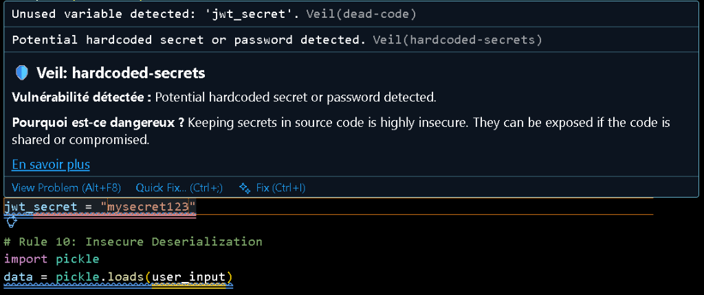
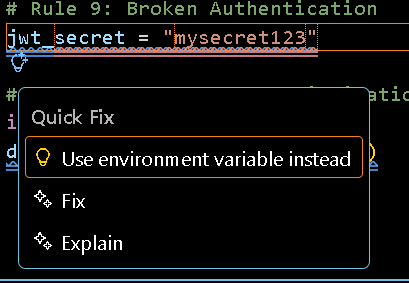

<p align="center">
  
</p>

# 🛡️ Veil — Real-Time AI Security for VS Code

<p align="center">
  <b>Detect vulnerabilities and get instant fixes before they ever leave your VS Code.</b>
</p>

<p align="center">
  <a href="https://opensource.org/licenses/MIT"></a>
  <a href="https://github.com/NICE-DEV226/Veil"></a>
  <a href="https://marketplace.visualstudio.com/items?itemName=NICE-DEV226.veil"></a>
  <a href="https://github.com/NICE-DEV226/Veil/actions/workflows/engine-build.yml"></a>
  <a href="https://github.com/NICE-DEV226/Veil/actions/workflows/extension-package.yml"></a>
</p>

---

**Veil** is a high-performance, **100% offline** security extension specifically built for **VS Code**. It detects vulnerabilities in code generated by AI assistants (GitHub Copilot, Cursor, Claude, etc.) in real-time, ensuring your intellectual property and application security stay robust on your local machine.

<p align="center">
  
</p>

---

## 🚀 Key Features

- **⚡ Real-Time Analysis**: Blazingly fast security checks (<200ms) as you type, powered by a local Go engine.
- **🛡️ 10 Core Security Rules**:
  - **Secrets**: Detection of hardcoded API keys and credentials.
  - **SQLi**: Prevention of unsafe dynamic query building.
  - **XSS**: Guarding against cross-site scripting in web apps.
  - **Command Injection**: Flagging dangerous system executions.
  - **Path Traversal**: Blocking unsafe file operations.
  - **Weak Crypto**: Warning about legacy algorithms (MD5, etc.).
  - **Dead Code**: Reducing attack surface by removing unused logic.
  - **Errors**: Ensuring safe exception and error handling patterns.
  - **Auth**: Detecting weak session and authentication logic.
  - **Deserialization**: Preventing RCE via unsafe data parsing.
- **🔒 100% Offline**: Zero external API calls. Your code never leaves your editor.
- **💡 Smart Quick Fixes**: Context-aware, one-click remediation for detected risks.

---

## 🏗️ Architecture

Veil uses a high-performance distributed architecture to ensure minimal impact on editor performance:

1.  **Engine (Go)**: A standalone analysis backend written in Go for raw speed. It uses AST parsing to verify code logic.
2.  **Extension (TypeScript)**: A premium VS Code integration that provides the diagnostics UI, hovers, and the "Noir" dashboard.
3.  **Communication**: Uses standard-compliant JSON-RPC over `stdin`/`stdout` for robust inter-process communication.

---

## 📸 Dashboard & Metrics

<p align="center">
  
</p>

Track your security progress in real-time with the built-in **Veil Dashboard**, featuring local statistics on findings, automated fixes, and your security streak.

---

## 🔧 Installation

Search for **"Veil"** in the VS Code Marketplace or install it via the terminal:

```bash
code --install-extension NICE-DEV226.veil
```

---

## 🤝 Support & Contribution

If you find Veil useful, please consider supporting the project:
- ⭐ **Star the Repository** to help others discover it.
- 👣 **Follow [@NICE-DEV226](https://github.com/NICE-DEV226)** for more security tools.
- 📧 **Collaboration**: Contact [nicedev226@gmail.com](mailto:nicedev226@gmail.com) for feature ideas.

---

## 👨‍💻 Author

**Sawadogo Azael (NICE-DEV)**  
*Security Researcher & Full-Stack Developer*

<p align="left">
  <a href="https://github.com/NICE-DEV226"></a>
  <a href="https://www.linkedin.com/in/aza%C3%ABl-wend-panga-sawadogo-8a4606259"></a>
</p>

---

## 📄 License

This project is licensed under the **MIT License**.  
*Protecting your code, one line at a time.* 🛡️💎
